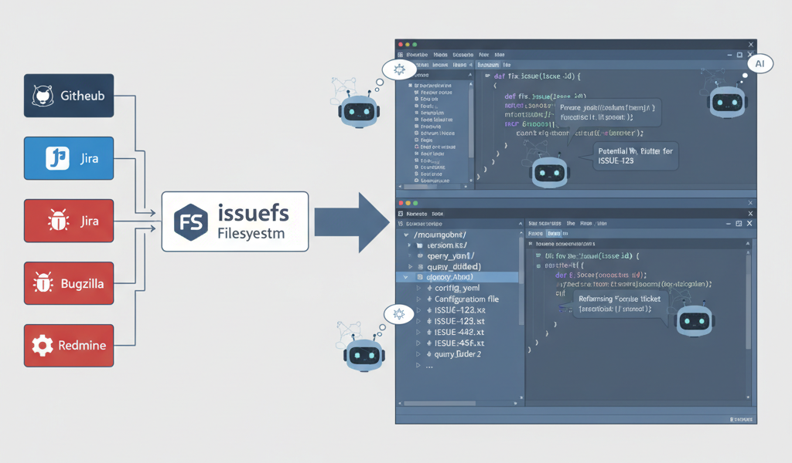

# issuefs
FUSE pseudo-filesystem that mounts JIRA and Github issues as read-only files



## Configuration

Create a `.env` file in the project root with:

```
JIRA_API_TOKEN=your_token_here
JIRA_URL=https://your-jira-instance.com

GITHUB_API_TOKEN=your_token_here
GITHUB_URL=https:/api.github.com

# Optional: Default mount point for the filesystem
# MOUNTPOINT=.issuefs/mnt

# Optional: Custom location for persistent query storage
# PERSISTENT_CONFIG=./jira_queries.yaml
```

## Usage

### Quick Start

```bash
# 1. Initial setup
make setup
# 2. Edit .env with your credentials
vim .env
# 3. Mount the filesystem
make run MOUNTPOINT=/tmp/test-issuefs
# 4. Create a query folder
mkdir /tmp/test-issuefs/my_project_bugs
# 5. Configure the query
vim /tmp/test-issuefs/my_project_bugs/config.yaml
# 6. Access the issues
ls /tmp/test-issuefs/my_project_bugs/
```

## Filesystem Structure

```
/mountpoint/
├── version.txt          # JIRA server version info (when enabled)
├── query_folder_1/
│   ├── config.yaml          # Configuration file
│   ├── ISSUE-123.txt        # Issue details
│   └── ISSUE-456.txt        # Issue details
└── query_folder_2/
    ├── config.yaml          # Configuration file
    └── ...
```

## Configuration File Format

Each query folder contains a `config.yaml` file with following format:

```yaml
enabled: false      # Set to true to fetch issues
persistent: false   # Set to true to save on unmount
jira:
  - jql: ''         # JQL query string
    issues: []      # Optional: List of specific issue keys to fetch
github:
  - repo: ''        # Target repository in owner/repo format
    q: ''           # Issue query string
    issues: []      # Optional: List of specific issue numbers to fetch
```

**Note:** The `issues` attribute allows you to explicitly specify individual issues by appropriate key,or id. The query folder will then show the union of query results and explicitly specified issues. 

## Unmounting

Press `Ctrl+C` in the terminal where the filesystem is running, or:

```bash
make umount
# Or for custom mount point:
make umount MOUNTPOINT=/tmp/test-issuefs
